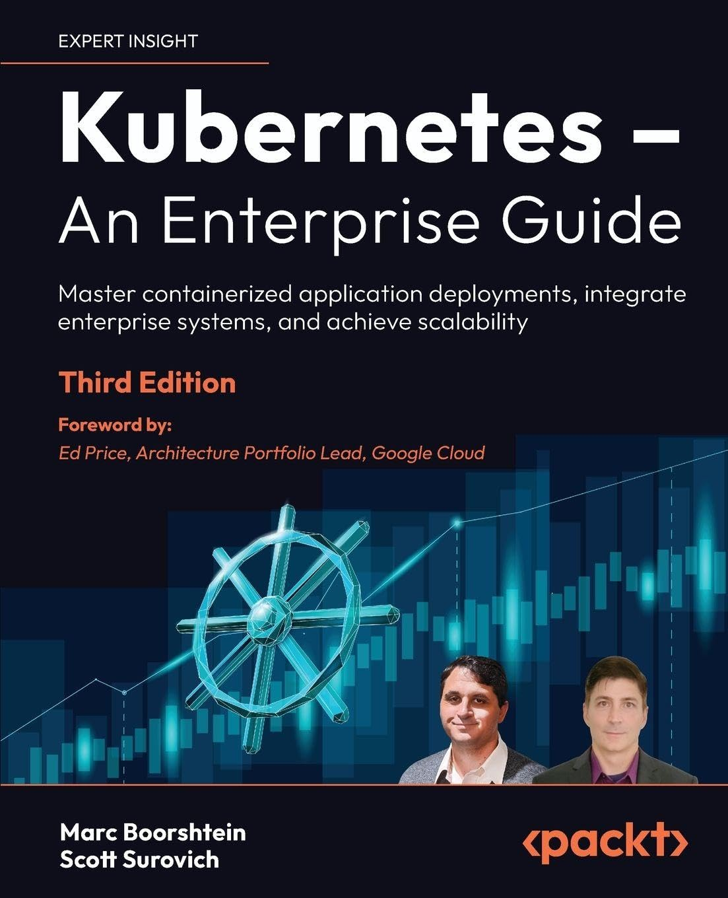

# [Book][Marc Boorshtein, Scott Surovich] Kubernetes – An Enterprise Guide – Third Edition [ENG, 2024]

**original src:**  
https://github.com/PacktPublishing/Kubernetes-An-Enterprise-Guide-Third-Edition

 

## Chapters:

<ol>
  <li>📖 Docker and Container Essentials</li>
  <li>Deploying Kubernetes Using KinD</li>
  <li>Kubernetes Bootcamp</li>
  <li>Services, Load Balancing, and Network Policies</li>
  <li>External DNS and Global Load Balancing</li>
  <li>Integrating Authentication into Your Cluster</li>
  <li>RBAC Policies and Auditing</li>
  <li>Managing Secrets</li>
  <li>Building Multitenant Clusters with vClusters</li>
  <li>Deploying a Secured Kubernetes Dashboard</li>
  <li>Extending Security Using Open Policy Agent</li>
  <li>Node Security with Gatekeeper</li>
  <li>KubeArmor Securing Your Runtime</li>
  <li>Backing Up Workloads</li>
  <li>Monitoring Clusters and Workloads</li>
  <li>An Introduction to Istio</li>
  <li>Building and Deploying Applications on Istio</li>
  <li>Provisioning a Multitenant Platform</li>
  <li>Building a Developer Portal</li>
</ol>

  

---

 

<a href="https://k8s.ru/">Предложить инженеру работу / подработку на проекте с kubernetes, microservices, machine learning, big data, golang</a>
